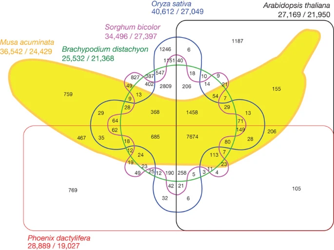
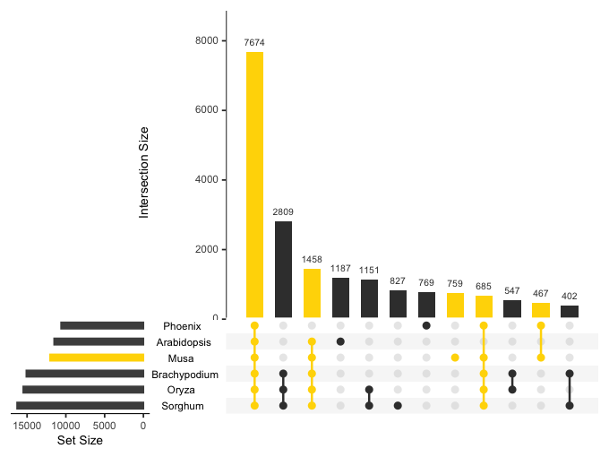

 

Data Communication - BCB 724 will be offered for the first time Fall
2023 at 11:00-12:15 TuTh, running from 
[November 2 to December 5](schedule). 
This BCB module will be taught by [Michael Love](https://mikelove.github.io).

This course is designed to prepare students to be effective
communicators of the results of analyses of biological and biomedical
data. Students will learn methods for data assessment and exploratory
data analysis (EDA), and how to visualize, write, and talk about data
in contexts such as emails, reports, lab meetings, publications, and
conference presentations. No technical or statistical background
required for enrollment. 
